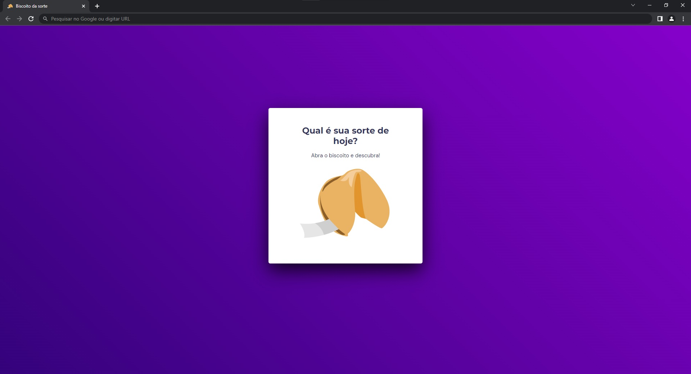

<h1 align="center"> Fortune Cookie </h1>

Projeto tem como objetivo masterizar/demonstrar qualidades técnicas no front-end.  

  <a href="#-tecnologias">Tecnologias</a>&nbsp;&nbsp;&nbsp;|&nbsp;&nbsp;&nbsp;
  <a href="#-projeto">Projeto</a>

  

 

## 🚀 Tecnologias

Esse projeto foi desenvolvido com as seguintes tecnologias:

- HTML e CSS
- JavaScript
- Git e Github

## 💻 Projeto

Este projeto, você encontrará uma experiência única e que mistura tradição e mistério. Acredito que cada biscoito guarda uma mensagem especial, capaz de trazer um toque de magia aos momentos do seu dia.

 <h3 align="start"> ⚙️ Funcionalidades</h3>
 
 Ao manter o seu mouse sobre o biscoito ele irá tremer e ao clicar vai abrir uma mensagem especial para você!
